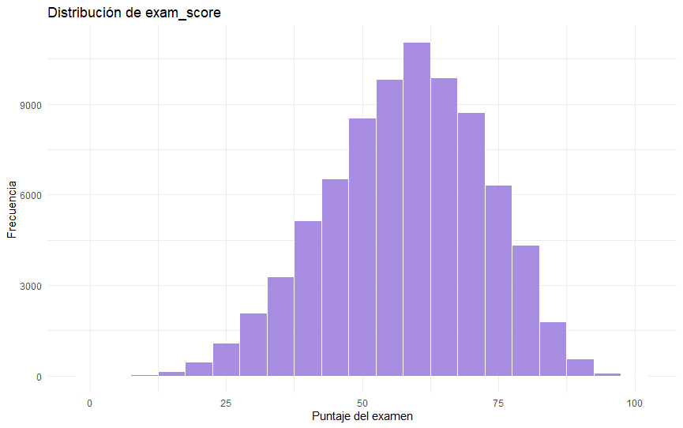
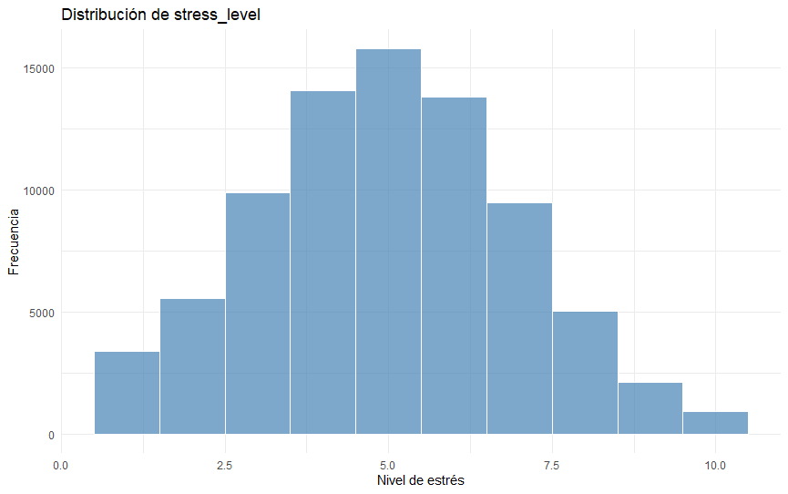
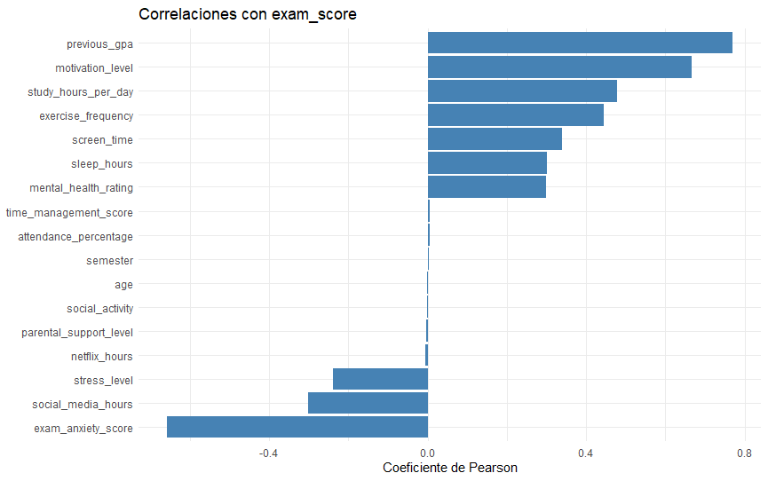
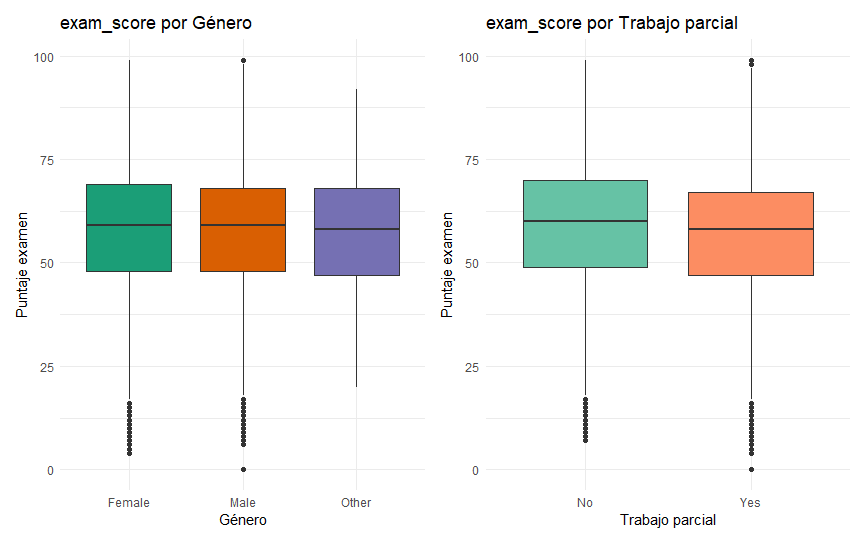
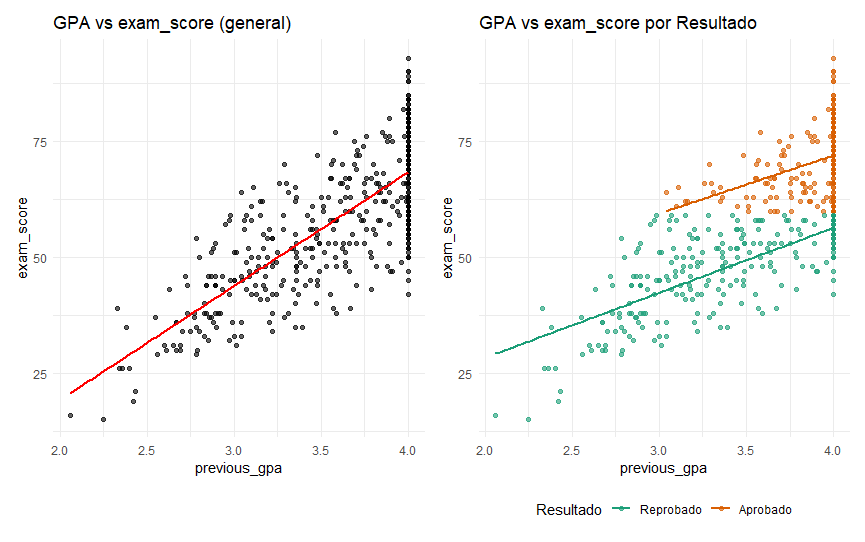
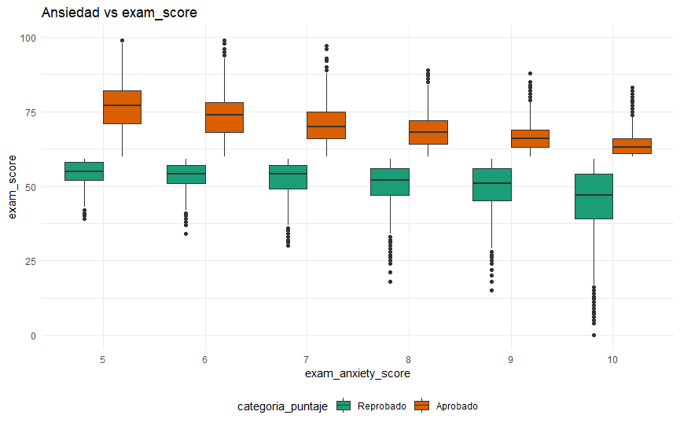
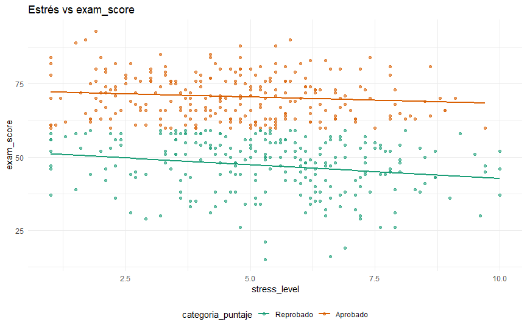

# Student Habits Performance - Análisis exploratorio en R

Proyecto académico de análisis exploratorio realizado para la Licenciatura en Estadística.  
El objetivo es estudiar la relación entre hábitos estudiantiles y rendimiento académico, tomando como variable principal `exam_score`.

## Preguntas guía

- ¿Cómo se relaciona el GPA previo con el puntaje del examen?
- ¿Cómo es la relación entre la ansiedad y el estrés con el puntaje del examen?
- ¿Existen diferencias de puntaje de examen según género y condición laboral?

## Herramientas utilizadas

- R
- tidyverse
- ggplot2
- patchwork
- knitr
- kableExtra
- here
- RColorBrewer

## Análisis realizado

El script incluye dos partes principales:

### Análisis univariado

- Resumen de variables numéricas.
- Comparación entre estudiantes aprobados y reprobados.
- Percentiles de `exam_score`.
- Distribución de `exam_score`.
- Distribución de `stress_level`.
- Tablas de frecuencia para variables categóricas.

### Análisis bivariado

- Correlaciones de variables numéricas con `exam_score`.
- Boxplots de `exam_score` por género y por trabajo parcial.
- Relación entre `previous_gpa` y `exam_score`.
- Relación entre ansiedad ante el examen y `exam_score`.
- Relación entre estrés y `exam_score`.

## Visualizaciones

### 1. Distribución de `exam_score`



### 2. Distribución de `stress_level`



### 3. Correlaciones con `exam_score`



### 4. `exam_score` por género y trabajo parcial



### 5. Relación entre `previous_gpa` y `exam_score`



### 6. Ansiedad ante el examen y `exam_score`



### 7. Estrés y `exam_score`



## Estructura del repositorio

```text
student-habits-performance-eda/
├── data/
│   └── student_habits_performance_5000.csv
├── images/
│   ├── 01_distribucion_exam_score.png
│   ├── 02_distribucion_stress_level.png
│   ├── 03_correlaciones_exam_score.png
│   ├── 04_boxplots_genero_trabajo_parcial.png
│   ├── 05_gpa_vs_exam_score.png
│   ├── 06_ansiedad_vs_exam_score.png
│   └── 07_estres_vs_exam_score.png
├── scripts/
│   └── analisis_rendimiento_estudiantil_original_adaptado.R
├── .gitignore
└── README.md
```

## Cómo ejecutar el proyecto

1. Abrir la carpeta del proyecto en RStudio.
2. Instalar los paquetes necesarios si no están instalados:

```r
install.packages(c("tidyverse", "patchwork", "knitr", "kableExtra", "here", "RColorBrewer"))
```

3. Ejecutar el script:

```r
source("scripts/script.R")
```

## Nota

El código fue adaptado para que lea el CSV desde la carpeta `data/` del repositorio.
